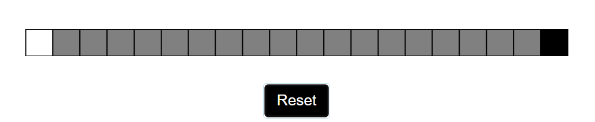

# Adjacent Cell Color Finder

This project is designed to solve a puzzle where you have 20 black and white cells. The leftmost cell is always white, and the rightmost cell is always black, while the colors of the remaining cells are hidden. The goal is to find two adjacent cells with different colors by clicking on the cells up to a maximum of 5 times. The project uses Python to automate the search, implementing multiple strategies to find a solution.

## Project Structure

- `script.py`: The main script that attempts to find adjacent cells of different colors using multiple strategies.
- `checkPos.py`: (Optional) Additional script for verifying or testing positions of cells.
- `README.md`: This file, containing project information.
- `image.png`: Screenshot of the puzzle interface for reference.

## How It Works

The script uses `pyautogui` for automated clicks and `PIL`/`OpenCV` to capture the color of each cell. The script attempts various strategies, clicking on selected cells in each strategy to maximize the chances of finding two adjacent cells with different colors.

If a "gray" cell is detected (indicating an unknown state or error), the script automatically resets the puzzle and attempts the next strategy.

### Key Features

- **20 Different Strategies**: The script cycles through 20 strategies, each with a unique approach to maximize the chances of solving the puzzle within the 5-click limit.
- **Auto Reset**: If a strategy fails, the script resets the puzzle and proceeds to the next strategy.
- **Adaptive Clicking**: The script recognizes pre-determined cells that are always white or black (leftmost and rightmost cells) and focuses only on the middle cells to optimize attempts.

